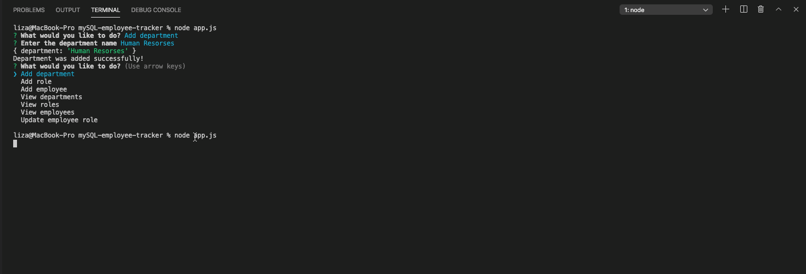

# mySQL-employee-tracker
## About
This application is a command line application for viewing, adding, and updating a MySQL database of employee. The database contains three tables: departments, employees, and roles.

## Database schema structure

* **department**:

  * **id** - INT PRIMARY KEY
  * **name** - VARCHAR(30) to hold department name

* **role**:

  * **id** - INT PRIMARY KEY
  * **title** -  VARCHAR(30) to hold role title
  * **salary** -  DECIMAL to hold role salary
  * **department_id** -  INT to hold reference to department role belongs to

* **employee**:

  * **id** - INT PRIMARY KEY
  * **first_name** - VARCHAR(30) to hold employee first name
  * **last_name** - VARCHAR(30) to hold employee last name
  * **role_id** - INT to hold reference to role employee has
  * **manager_id** - INT to hold reference to another employee that manager of the current employee. This field may be null if the employee has no manager

## Demo

  ## Technologies Used
- JavaScript - Core logic
- Node and NPM
- Express
- MYSQL
- Git - version control system to track changes to source code
- GitHub - hosts repository that can be deployed to GitHub Pages